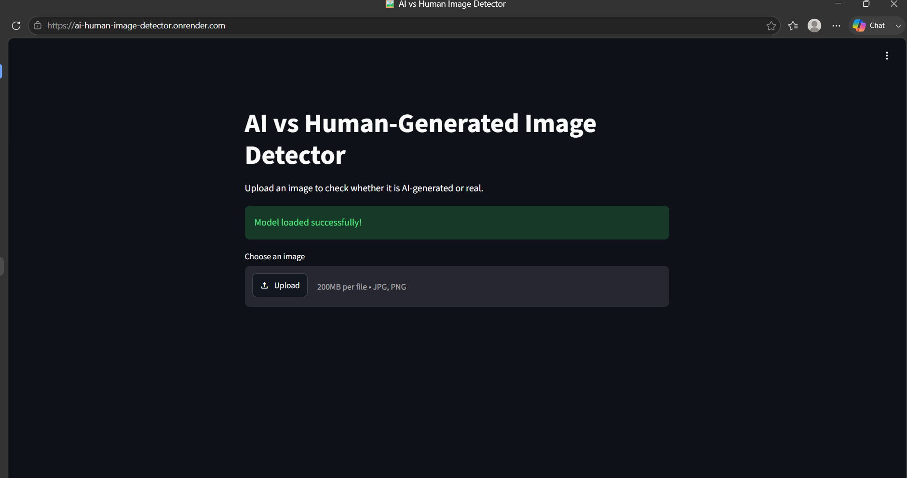
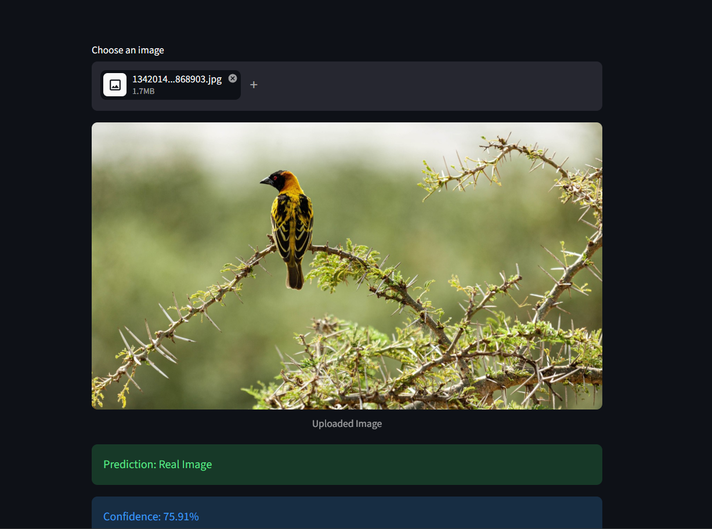
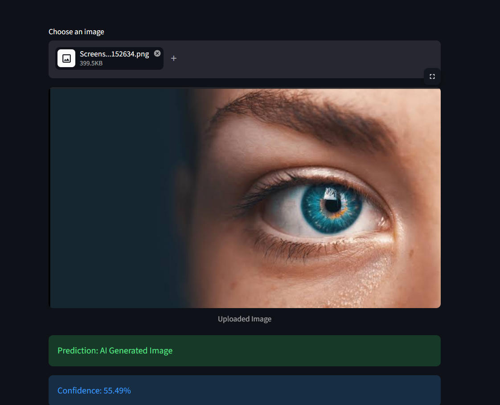

# AI vs Human-Generated Image Detector

A deep learning-based application that detects whether an image is AI-generated or a real image.

## Live Demo

🔗 https://ai-human-image-detector.onrender.com

## Project Overview

With the rapid growth of AI-generated images, distinguishing between real and synthetic images has become challenging. This project uses a deep learning model to classify uploaded images as either AI-generated or real.

## Features

- Upload an image for analysis
- AI-generated vs Real image classification
- Confidence score prediction
- Interactive Streamlit web interface
- Real-time image prediction
- Cloud deployment using Render

## Technologies Used

- Python
- TensorFlow
- Keras
- Streamlit
- NumPy
- Pillow
- CNN Deep Learning Model

## Screenshots

### Application Interface

### Real Image Prediction

### AI Generated Image Prediction

## Project Structure

## Deployment

The application is deployed on Render and provides real-time image classification through a web interface.

## Author

Harshitha R
